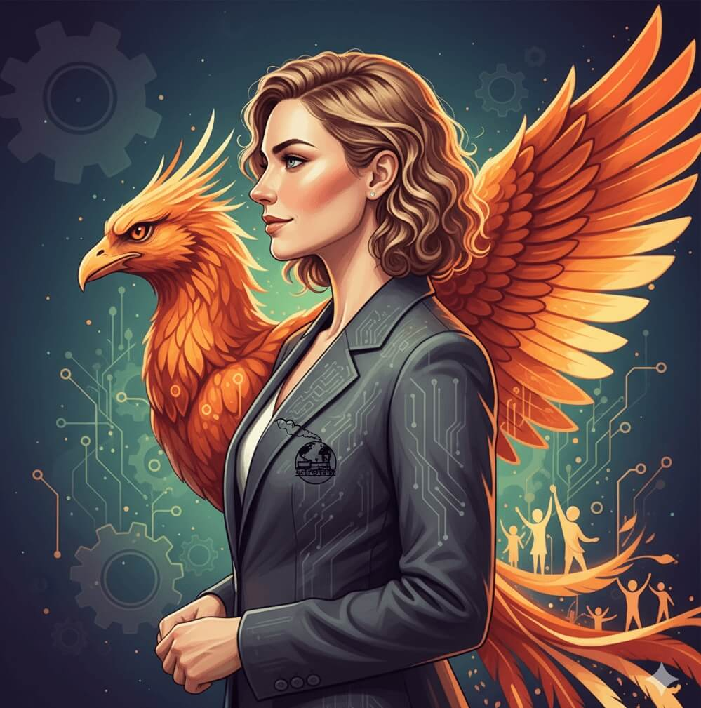
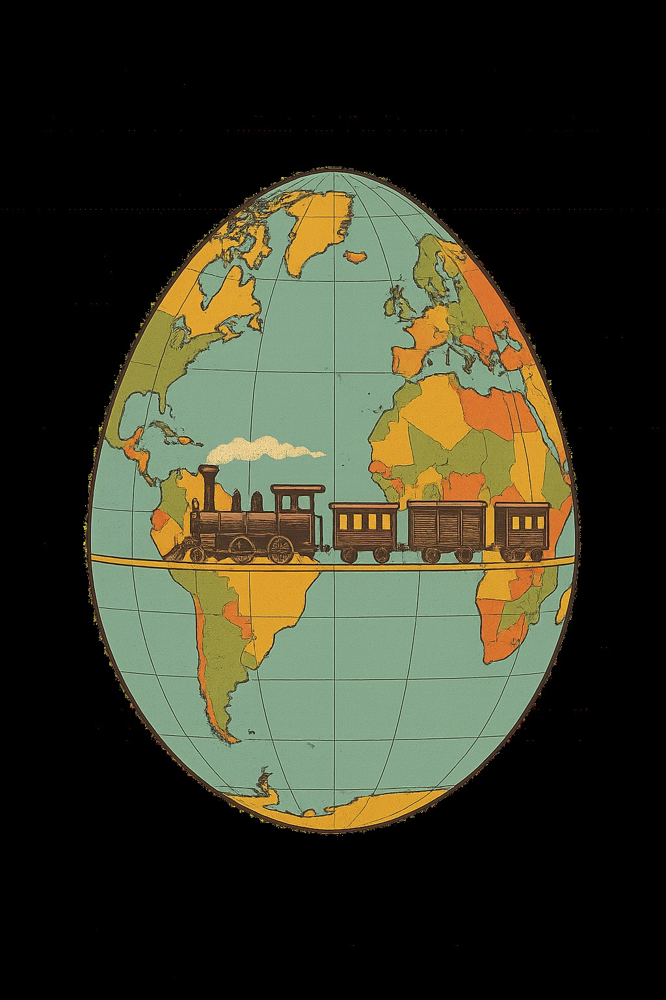
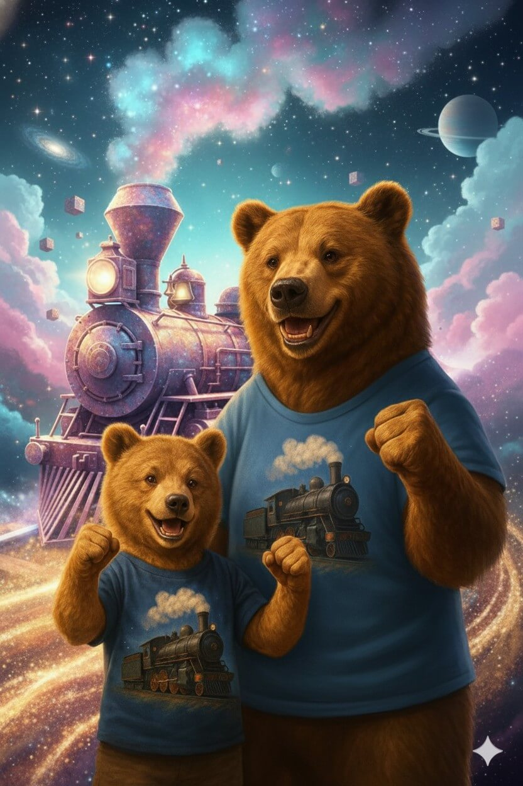
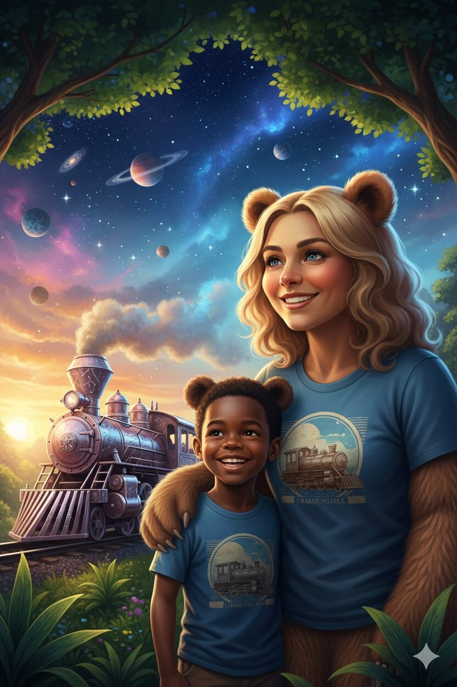
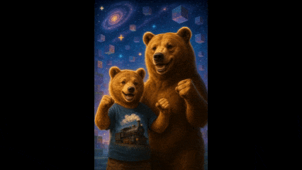

# HEIDI KALSKE-AKINTOBI

<div align="center">

**AI INNOVATION • CHILD ADVOCACY • TRAUMA-INFORMED TECH**

*Building the future where technology protects—not exploits*

---



[](https://hidikoo.github.io/Hidikoo/)

---

[](https://www.linkedin.com/in/heidi-kalske-akintobi-38065492)
[](https://github.com/Hidikoo)
[](https://www.photini.family)
[](mailto:hello@photini.family)

</div>

---

## ABOUT

After a decade in finance & risk management (**KPMG** & accounting and working banking sector), I founded **[Photini Family™](https://www.photini.family)** in 2025—an ecosystem combining **AI innovation**, **child protection advocacy**, and **trauma-informed technology**.

**My mission:** Create systems that embed human rights into their architecture—not as an afterthought.

---

## CURRENT FOCUS

```
🚀 Building Photini's Go-Driver    → AI-powered legal aid toolkit (GDPR/ISO-compliant)
📚 Writing Cosmic Bear Adventure   → Children's book series on hope & family separation
🔍 Researching Nordic Discrimination → Evidence-based policy reform for child protection
🌍 Advocating Case Finland         → Systemic reform in immigrant family and children rights
```

---

## PHOTINI FAMILY™ ECOSYSTEM

<div align="center">



</div>

Three waves. One mission.

| **WAVE** | **MISSION** | **TECH** |
|----------|-------------|----------|
| **Photini™ apps** | Advocacy & case documentation | Go-Driver • Evidence management • AI compliance |
| **Rhea Network™ and Rhea apps** | Healing & trauma research | Data science • Trauma-informed AI • Evidence synthesis |
| **Nektarios™** | Governance & AI ethics | ISO frameworks • ERP • Compliance-by-design |

> *"Quality, trust, and data integrity with AI hand-in-hand with humans; misinformation is more dangerous than responsible data sharing."*

---

## FEATURED PROJECT: Photini's GO-DRIVER

**[Photini's Go-Driver](https://github.com/Hidikoo/Photini-Go-Driver)** – Next-generation advocacy & compliance platform

**What it does:**
Go-Driver transforms how advocates protect vulnerable populations by turning scattered evidence and manual processes into a secure, AI-augmented system that never forgets, always audits, and puts victims in control. It's a AI-powered co-pilot for NGOs, lawyers, and grassroots defenders—designed to amplify their impact while protecting the people they serve.

Go-Driver solves the crisis of evidence fragmentation and accountability gaps in human rights work. It consolidates case files, maintains immutable audit trails, and provides AI recommendations—always with mandatory human review. Think of it as a compliance-first command center for advocates who can't afford to lose a single piece of evidence or make a single privacy mistake, an aid kit that combines international case law, latest research and your case evidence into one clear information package.

Go-Driver pioneers **Compliance-by-Design** architecture—where ethics aren't bolted on after development, but embedded in the database schema, API logic, and AI workflows from day one from the ground up. It empowers advocates with AI-powered case management, evidence synthesis, and workflow automation—while ensuring every decision is traceable, every access is logged, and every vulnerable person's data and rights are protected.

*Built on:*
- ✅ GDPR Art. 25 (Privacy by Design) from database schema up
- ✅ EU AI Act transparency & mandatory human-in-loop controls
- ✅ Trauma-informed NLP for vulnerable populations
- ✅ ISO 27001/27701/42001 compliance roadmap

It is built for NGOs, lawyers, and grassroots defenders who protect vulnerable populations—especially children and asylum seekers. It will later be developed to more wider use with its innovative design where it is suitable to solve many other problems among human rights, project management and human processes...

**Status:** MVP Q2 2026 | ISO certifications Q3 2026

**[→ View Documentation](https://hidikoo.github.io/Photini-Go-Driver/)**

---

## COSMIC BEAR ADVENTURE

<div align="center">


</div>

**Journey of the Star Train** – A children's book series helping kids cope with family separation & trauma.

**The Story:** Little Otso the bear cub embarks on a cosmic journey aboard the magical Star Train—a tale of hope, courage, and love across impossible distances.

<table align="center">
  <tr>
    <td></td>
    <td></td>
    <td></td>
  </tr>
<table>

**Features:**
- 🐻 Age-appropriate emotional processing tools
- 💙 Trauma-informed guidance for adults
- 🌍 Bilingual (Finnish/English)
- 🎨 AI-generated illustrations

**Status:** Seeking publishers | GoFundMe Q4 2025 | Collecting feedback from trauma professionals and translating into several other languages

---

## TECH STACK

```yaml
Backend:     Xano (no-code DB/API) • Docker • n8n
Frontend:    WeWeb • HTML/CSS/JS • GitHub Pages
AI/ML:       ChatGPT Pro • Perplexity Pro • Gemini 2.5 Flash • NotebookLLM
Compliance:  ISO 27001/27701/42001 frameworks • GDPR tooling
Data:        Python • Pandas • Jupyter • RAG pipelines
Design:      AI-generated visuals • Gemini 2.5 Flash • Sora 1 • Higgsfield.ai
```

---

## BACKGROUND

### Professional Journey

| **PERIOD** | **ROLE** | **ORGANIZATION** | **FOCUS** |
|------------|----------|------------------|-----------|
| **2015-2025** | Assistant Manager, Risk & Compliance | KPMG Finland | Public and Private Services Audit • GDPR • ESG • IT |
| **2010-2015** | Financial Consultant & Accountant & Byer| Accountor Banking & Insurance Sector • Pohjola Insurance • Nokia Telecommunications| Accounting • Regulatory Reporting • Insurance handling personal products • Global telecommunications mast technology|
| **2025-Present** | Founder & CEO | Photini Family™ | AI Ethics • Child Advocacy • Tech Innovation |

### Education & Certifications

- 🎓 **Bachelor of Business Administration (BBA) specialized in Accounting and Finance** – Haaga-Helia University of Applied Sciences & Master degree student in Vaasa University. Major in Accounting and Auditing and wide minor in Business law
- 📜 **Assistant Manager KPMG IT-Audits, Public and Private Regulatory Audits, EU and National Funds Special Audits and ESG-audits** (2017-2025)
- 🤖 **AI Ethics & Governance** (Self-taught + AI mentorship)
- 🧠 **Trauma-Informed Design Principles** (Research-based)

---

## ADVOCACY & IMPACT

**Human Rights Focus:**
- 👶 **Child Protection Reform** – Exposing systemic failures in Nordic child welfare
- 🌏 **Immigrant Family Rights** – Documenting discrimination against minority families
- 🔓 **Transparency in AI** – Fighting "black box" decision-making
- 💙 **Trauma-Informed Tech** – Designing systems that understand secondary trauma

**Current Campaigns:**
- ✊ **#CaseFinland** – Political asylum case highlighting systemic failures
- 📢 **Nordic Discrimination Report** – Evidence-based research (Q1 2026 publication)
- 📚 **Cosmic Bear Adventure** – Healing stories for separated children worldwide

---

## GITHUB STATS

<div align="center">


</div>

---

## CONTACT & COLLABORATION

**I'm always open to:**
- 🤝 **NGO Partnerships** for Go-Driver pilot testing and/or data sharing of cultural assimilation challenges and children human rights
- 🎨 **Children's Book Translators and Trauma Aid Solutions** for Cosmic Bear series
- 💼 **Impact Investors** interested in ethical AI for human rights
- 🔬 **Researchers** studying trauma-informed AI design and logical aid measures for children welfare
- 📰 **Media** covering immigrant & most vulnerable family rights & AI ethics

**Reach out:**

| **CHANNEL** | **LINK** |
|-------------|----------|
| 💼 LinkedIn | [heidi-kalske-akintobi-38065492](https://www.linkedin.com/in/heidi-kalske-akintobi-38065492) |
| 📧 Community | [hello@photini.family](mailto:hello@photini.family) |
| 📧 Official | [info@photini.org](mailto:info@photini.org) |
| 📧 Personal | [heidi.kalskeakintobi@photini.family](mailto:heidi.kalskeakintobi@photini.family) |
| 🌐 Website | [www.photini.family](https://www.photini.family) |
| 💻 GitHub | [@Hidikoo](https://github.com/Hidikoo) |

---

## 2025-2026 GOALS

✅ **Q4 2025:**
- Launch photini.family website
- Publish Cosmic Bear Adventure (Book 1)
- Go-Driver MVP with 3 NGO pilot cases
- GoFundMe campaign

✅ **Q1 2026:**
- Nordic Discrimination research publication
- Media campaign for Case Finland
- ISO 27001 readiness audit

✅ **Q2-Q3 2026:**
- ISO 27001/27701 certifications
- Go-Driver v1.0 public launch
- Cosmic Bear Book 2 draft
- International advocacy speaking tour

---

## PHILOSOPHY

> **"Every child deserves a world where technology protects them, stories heal them, and networks unite them with those they love—no matter the distance."**

**Stories that heal | Technology that protects | Networks that unite**

---

<div align="center">



**Thank you for visiting.**

**Let's build a better future—one line of code, one story, one child at a time.**

💙 🚂 ✨

---

**© 2025 Heidi Kalske-Akintobi | Photini Family™**

</div>
